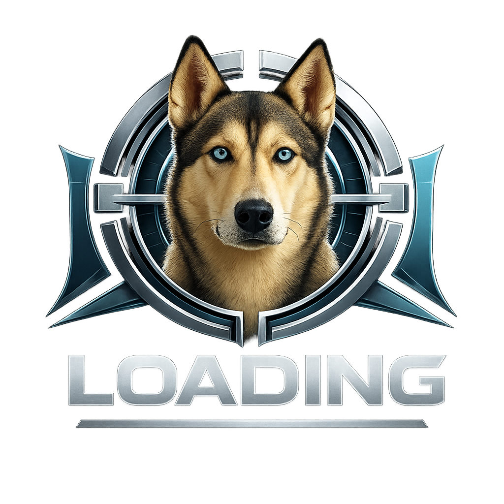

<p align="center">
  
</p>

<h1 align="center">ZED - Assistente Virtual Inteligente</h1>

<p align="center">
  <strong>Seu assistente pessoal com IA para organizar sua vida</strong>
</p>

<p align="center">
  <a href="#-sobre-o-projeto">Sobre</a> •
  <a href="#-funcionalidades">Funcionalidades</a> •
  <a href="#-tecnologias">Tecnologias</a> •
  <a href="#-instalação">Instalação</a> •
  <a href="#-estrutura">Estrutura</a> •
  <a href="#-licença">Licença</a>
</p>

<p align="center">
  
  
  
  
  
</p>

---

## 📖 Sobre o Projeto

**ZED** é um assistente virtual pessoal inspirado no JARVIS, projetado para ser seu "dashboard de vida". Ele centraliza todas as suas necessidades de organização pessoal em uma única plataforma inteligente, combinando chat com IA, gerenciamento de tarefas, controle financeiro, agenda e muito mais.

### 🎯 Visão

Criar um hub pessoal onde você pode:
- Conversar naturalmente com uma IA que entende seu contexto
- Organizar tarefas apenas falando ou digitando
- Controlar finanças de forma simples e visual
- Manter uma agenda integrada com lembretes inteligentes
- Refletir sobre seu dia com um diário guiado
- Acompanhar metas e hábitos de longo prazo

---

## ✨ Funcionalidades

### 💬 Chat Inteligente com ZED

O ZED é seu assistente pessoal que **realmente executa ações**:

```
Você: "Cria uma tarefa para pagar a conta de luz amanhã"
ZED: "✅ Criei um lembrete para pagar a conta de luz amanhã!"
→ A tarefa é salva automaticamente no banco de dados
```

**Comandos suportados:**
- 📋 **Criar tarefas**: "Lembre-me de...", "Adiciona tarefa..."
- 📅 **Agendar eventos**: "Agenda reunião...", "Marca compromisso..."
- 💰 **Registrar gastos**: "Gastei X reais em...", "Registra despesa..."
- 🎯 **Criar metas**: "Quero criar uma meta de..."

### 📋 Gerenciador de Rotina (Kanban)

Sistema completo de gerenciamento de tarefas:

| Recurso | Descrição |
|---------|-----------|
| **Kanban** | Organize tarefas em colunas: A Fazer → Fazendo → Concluído |
| **Prioridades** | Alta, Média, Baixa com cores visuais |
| **Categorias** | Pessoal, Trabalho, Estudos, Saúde, Casa/Família |
| **Esforço/Energia** | Defina o nível de esforço e energia necessários |
| **Filtros** | Filtre por status, categoria ou busca |
| **Drag & Drop** | Arraste tarefas entre colunas |

### 💰 Controle Financeiro

Gerencie suas finanças de forma visual e intuitiva:

- **Resumo financeiro**: Saldo, receitas e despesas do mês
- **Gráficos por categoria**: Visualize onde você gasta mais
- **Histórico de transações**: Lista completa com filtros
- **Registro rápido**: Adicione transações em segundos
- **Categorias**: Alimentação, Transporte, Moradia, Lazer, Saúde, etc.

### 📅 Agenda Inteligente

Calendário completo com múltiplas visualizações:

- **Vista mensal**: Calendário tradicional com eventos
- **Vista semanal**: Agenda detalhada por dia
- **Vista lista**: Próximos eventos em formato de lista
- **Tipos de evento**: Reunião, Pessoal, Lembrete, Ligação
- **Localização**: Adicione onde será o evento
- **Cores personalizadas**: Identifique eventos visualmente

### 🎯 Metas e Objetivos

Sistema de acompanhamento de metas por prazo:

- **Curto prazo**: Metas para o mês atual
- **Médio prazo**: Metas para 3-6 meses
- **Longo prazo**: Metas anuais
- **Áreas da vida**: Saúde, Financeiro, Estudos, Trabalho, Pessoal
- **Progresso visual**: Barra de progresso com porcentagem
- **Milestones**: Divida metas em etapas menores

### ✅ Checklists Inteligentes

Listas reutilizáveis com templates prontos:

- **Templates**: Mercado, Viagem, Prova/Entrega
- **Itens com checkbox**: Marque o que já foi feito
- **Progresso**: Veja a porcentagem de conclusão
- **Duplicar**: Reutilize listas facilmente
- **Personalizável**: Crie suas próprias listas

### 📔 Diário & Coach

Reflexão diária guiada com insights:

- **Humor do dia**: Excelente, Bom, Neutro, Ruim, Péssimo
- **O que foi bem**: Registre suas vitórias
- **O que melhorar**: Identifique áreas de crescimento
- **Foco para amanhã**: Defina suas prioridades
- **Streak**: Sequência de dias escrevendo
- **Insights semanais**: ZED gera reflexões baseadas em seus registros

### ⏱️ Foco & Pomodoro

Timer para produtividade:

- **Pomodoro**: 25 minutos de foco + 5 de pausa
- **Blocos personalizados**: Configure seu tempo ideal
- **Histórico**: Veja quantos blocos você completou
- **Integração com tarefas**: Associe sessões a tarefas específicas

### 👨‍💼 Painel Administrativo

Para gerenciar o sistema (acesso restrito):

- **Gestão de usuários**: Ver, editar, desativar contas
- **Estatísticas**: Métricas de uso do sistema
- **Logs de atividade**: Histórico de ações
- **Configurações do sistema**: Ajustes globais

---

## 🛠️ Tecnologias

### Frontend
| Tecnologia | Uso |
|------------|-----|
| **Next.js 15** | Framework React com App Router |
| **React 19** | Biblioteca de UI |
| **TypeScript 5** | Tipagem estática |
| **TailwindCSS 4** | Estilização utility-first |
| **Framer Motion** | Animações fluidas |
| **Lucide React** | Ícones modernos |

### Backend & Database
| Tecnologia | Uso |
|------------|-----|
| **Supabase** | Backend-as-a-Service |
| **PostgreSQL** | Banco de dados relacional |
| **Row Level Security** | Segurança por usuário |
| **Supabase Auth** | Autenticação completa |

### IA & APIs
| Tecnologia | Uso |
|------------|-----|
| **Google Gemini** | IA para o chat (gratuito) |
| **Edge Functions** | Processamento serverless |

### UI Components
| Tecnologia | Uso |
|------------|-----|
| **Magic UI** | Componentes animados |
| **class-variance-authority** | Variantes de componentes |
| **clsx + tailwind-merge** | Merge de classes CSS |
| **react-hot-toast** | Notificações |

---

## 🚀 Instalação

### Pré-requisitos

- **Node.js** 18 ou superior
- **npm** ou **yarn**
- Conta no [Supabase](https://supabase.com) (gratuito)
- Chave API do [Google AI Studio](https://makersuite.google.com/app/apikey) (gratuito)

### Passo a Passo

#### 1. Clone o repositório

```bash
git clone https://github.com/seu-usuario/zed.git
cd zed
```

#### 2. Instale as dependências

```bash
npm install
```

#### 3. Configure as variáveis de ambiente

Crie um arquivo `.env` na raiz do projeto:

```env
# ====================================
# SUPABASE
# Obtenha em: https://supabase.com/dashboard/project/_/settings/api
# ====================================
NEXT_PUBLIC_SUPABASE_URL=https://seu-projeto.supabase.co
NEXT_PUBLIC_SUPABASE_ANON_KEY=sua-anon-key-aqui
SUPABASE_SERVICE_ROLE_KEY=sua-service-role-key-aqui

# ====================================
# GOOGLE GEMINI (IA do Chat)
# Obtenha em: https://makersuite.google.com/app/apikey
# ====================================
GEMINI_API_KEY=sua-gemini-api-key-aqui
```

#### 4. Configure o Supabase

O banco de dados já está configurado se você conectou via MCP. Caso contrário, execute as migrations disponíveis em `supabase/migrations/`.

#### 5. Inicie o servidor

```bash
npm run dev
```

#### 6. Acesse o projeto

Abra [http://localhost:3000](http://localhost:3000) no navegador.

---

## 📁 Estrutura do Projeto

```
ZED/
├── public/
│   └── logo.png                 # Logo do ZED
│
├── src/
│   ├── app/
│   │   ├── (auth)/              # 🔐 Autenticação
│   │   │   ├── login/           # Página de login
│   │   │   ├── signup/          # Página de cadastro
│   │   │   └── layout.tsx       # Layout com background
│   │   │
│   │   ├── (dashboard)/         # 📊 Área Logada
│   │   │   └── dashboard/
│   │   │       ├── page.tsx     # Dashboard principal
│   │   │       ├── chat/        # 💬 Chat com ZED
│   │   │       ├── routine/     # 📋 Kanban de tarefas
│   │   │       ├── finances/    # 💰 Controle financeiro
│   │   │       ├── schedule/    # 📅 Agenda
│   │   │       ├── goals/       # 🎯 Metas
│   │   │       ├── checklists/  # ✅ Checklists
│   │   │       ├── journal/     # 📔 Diário
│   │   │       ├── focus/       # ⏱️ Pomodoro
│   │   │       └── settings/    # ⚙️ Configurações
│   │   │
│   │   ├── (admin)/             # 👨‍💼 Painel Admin
│   │   │   └── admin/
│   │   │       ├── page.tsx     # Dashboard admin
│   │   │       └── users/       # Gestão de usuários
│   │   │
│   │   ├── api/                 # 🔌 API Routes
│   │   │   ├── chat/            # Endpoint do chat (Gemini)
│   │   │   └── actions/         # Endpoint de ações
│   │   │
│   │   ├── layout.tsx           # Layout raiz
│   │   └── page.tsx             # Landing page
│   │
│   └── shared/
│       ├── components/
│       │   ├── atoms/           # 🔹 Componentes básicos
│       │   │   ├── Button.tsx
│       │   │   ├── Input.tsx
│       │   │   ├── Badge.tsx
│       │   │   ├── Avatar.tsx
│       │   │   ├── Spinner.tsx
│       │   │   └── ZedLogo.tsx
│       │   │
│       │   ├── molecules/       # 🔸 Componentes compostos
│       │   │   ├── Card.tsx
│       │   │   └── Modal.tsx
│       │   │
│       │   └── organisms/       # 🔶 Componentes complexos
│       │       ├── Header.tsx
│       │       ├── Sidebar.tsx
│       │       └── BackgroundGradient.tsx
│       │
│       ├── hooks/               # 🪝 React Hooks
│       │   ├── useSupabaseAuth.ts
│       │   ├── useTasks.ts
│       │   ├── useTransactions.ts
│       │   ├── useEvents.ts
│       │   ├── useGoals.ts
│       │   ├── useChecklists.ts
│       │   ├── useJournal.ts
│       │   └── useAdmin.ts
│       │
│       ├── lib/
│       │   ├── utils.ts         # Utilitários (cn, formatters)
│       │   ├── gemini.ts        # Cliente Google Gemini
│       │   └── supabase/        # Cliente Supabase
│       │
│       └── styles/
│           └── globals.css      # Estilos globais + Tailwind
│
├── .env.local                   # ⚠️ Variáveis de ambiente (não versionar)
├── package.json
├── tailwind.config.ts
├── tsconfig.json
└── README.md
```

---

## 🎨 Design System

### Cores

| Nome | Hex | Uso |
|------|-----|-----|
| **Azul Principal** | `#3B82F6` | CTAs, links, destaque |
| **Prata** | `#A1A1AA` | Textos secundários |
| **Dourado** | `#F59E0B` | Botões premium, badges |
| **Background** | `#0A101F` | Fundo principal |
| **Card** | `#111827` | Fundo de cards |

### Tipografia

- **UI**: Inter (limpa e moderna)
- **Código**: JetBrains Mono
- **Tamanhos**: sm (14px), base (16px), lg (18px), xl+ (títulos)

### Componentes

Todos os componentes seguem o padrão **Atomic Design**:

- **Atoms**: Button, Input, Badge, Avatar, Spinner
- **Molecules**: Card, Modal
- **Organisms**: Header, Sidebar, BackgroundGradient

---

## 📱 Responsividade

O ZED é totalmente responsivo:

| Dispositivo | Comportamento |
|-------------|---------------|
| **Mobile** (< 768px) | Menu inferior, cards em coluna única |
| **Tablet** (768px - 1024px) | Sidebar lateral, grid 2 colunas |
| **Desktop** (> 1024px) | Layout completo com sidebar fixa |

---

## 🔐 Segurança

- **Row Level Security (RLS)**: Cada usuário só vê seus próprios dados
- **Autenticação Supabase**: Login seguro com email/senha
- **Service Role Key**: Usada apenas no servidor para ações do chat
- **Validação de inputs**: Todos os formulários são validados

---

## 🚧 Roadmap

- [ ] Integração com Google Calendar
- [ ] Notificações push
- [ ] App mobile (React Native)
- [ ] Reconhecimento de voz
- [ ] OCR para escanear recibos
- [ ] Relatórios exportáveis (PDF)
- [ ] Temas personalizáveis
- [ ] Integração com WhatsApp

---

## 🤝 Contribuindo

Contribuições são bem-vindas! 

1. Faça um fork do projeto
2. Crie uma branch para sua feature (`git checkout -b feature/AmazingFeature`)
3. Commit suas mudanças (`git commit -m 'Add some AmazingFeature'`)
4. Push para a branch (`git push origin feature/AmazingFeature`)
5. Abra um Pull Request

---

## 📄 Licença

Este projeto está sob a licença MIT. Veja o arquivo [LICENSE](LICENSE) para mais detalhes.

---

<p align="center">
  <strong>Feito com 💙 pela equipe ZED</strong>
  <br />
  © 2025 ZED. Todos os direitos reservados.
</p>
